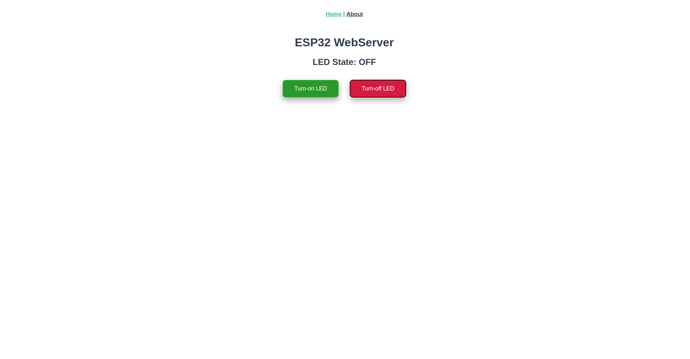

# LED Controller with ESP32 HTTP Webserver

$ cd front/led  
$ npm run build  

$ cd ../..  
$ get_idf  
$ idf.py menuconfig  
Exmaple Connection -> Enter SSID and Password of your wifi  
$ idf.py build flash monitor  

